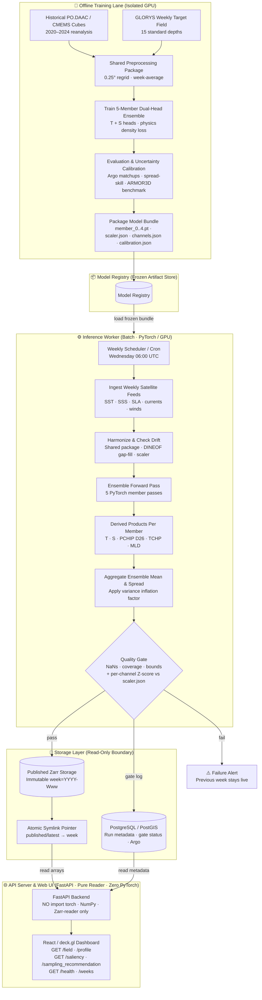

# OceanEmbed Backend — Plan & Architecture Analysis

## What This System Is

A **read-only serving layer** that exposes pre-computed, versioned weekly ocean model outputs as JSON (and binary buffers) for a dashboard. It never runs the model or imports PyTorch. Its job is pure reading + serving.

---

## The Three-Lane Architecture



---

## Key Design Decisions (Locked)

### ✅ Atomic Symlink Publish Pattern
`published/latest` is a symlink that gets **atomically repointed** after each successful weekly inference. This means:
- Readers never see a half-written week
- If quality gate fails → the old week's symlink stays live, no downtime

### ✅ The Critical Fix: Don't Cache "latest" Forever
> **This was the biggest bug in the earlier draft.**

If the API resolves `published/latest` once at startup and holds that handle forever, it will silently serve stale data after a new week publishes — **no error, no crash, just wrong dates on the dashboard.**

**The fix pattern** (in `zarr_reader.py`):
```python
# On every request (or every N seconds):
current_week = os.readlink("published/latest")  # cheap syscall
if current_week != self._cached_week:
    self._store = xr.open_zarr(current_week)
    self._cached_week = current_week
return self._store
```

### ✅ Binary Payload for `/field`
Full domain grid (North Indian Ocean, 0.25°, 15 depths) = ~360,000 floats.
- `.values.tolist()` → JSON ≈ **12+ MB** → blocks event loop
- `float32.tobytes()` + `application/octet-stream` ≈ **~1.5 MB** ✅

Single-point endpoints like `/profile` **stay plain JSON** (only ~hundreds of floats).

### ✅ Frozen Model Bundle
All 4 artifacts travel together in the model registry:
```
member_0..4.pt   ← weights
scaler.json      ← training mean/std per channel (also used in quality gate!)
channels.json    ← exact channel order the model was trained on
calibration.json ← variance inflation factor
```
This structurally closes the "5 vs 12 channels" ambiguity — the model's own training artifact is the source of truth.

### ✅ `oceanembed_core` as a Shared Package
Preprocessing lives at `core/` (repo root), installed by **both** `worker/` and the offline training code. Never nested under `worker/` — that would make copy-pasting (and silent train/serve skew) the path of least resistance.

---

## Tech Stack

| Layer | Choice |
|---|---|
| API Server | FastAPI + Python (**zero PyTorch**) |
| Inference Worker | Separate container, PyTorch, GPU |
| Gridded Store | Zarr, **1 immutable dir per week** |
| Publish Mechanism | **Atomic symlink swap** |
| Metadata + Spatial | PostgreSQL + PostGIS |
| Model Artifacts | Frozen bundle in **model registry** |
| Frontend | React + Vite + MapLibre GL + deck.gl + Plotly.js |
| Config | pydantic-settings + `.env` |
| Testing | pytest + FastAPI `TestClient` |
| CI | GitHub Actions |
| Containers | Docker + docker-compose (from day one) |

---

## Target Project Structure (Per Plan)

```
oceanembed-backend/
├── docker-compose.yml
├── .env.example
├── core/                    ← installable shared package (oceanembed_core)
│   ├── pyproject.toml
│   └── oceanembed_core/
│       └── preprocessing/   ← ONE implementation, used by both lanes
├── api/
│   ├── Dockerfile           ← NO torch
│   └── app/
│       ├── main.py          ← lifespan: DB pool only
│       ├── config.py        ← pydantic-settings
│       ├── deps.py          ← DB session + Zarr resolver dependency
│       ├── routers/
│       │   ├── field.py     ← GET /field (binary buffer)
│       │   ├── profile.py   ← GET /profile (JSON)
│       │   ├── saliency.py
│       │   ├── sampling.py
│       │   ├── benchmark.py
│       │   └── health.py    ← GET /health, GET /weeks
│       ├── schemas/         ← Pydantic response models
│       └── services/
│           ├── zarr_reader.py    ← symlink re-resolution logic
│           └── postgis_queries.py
├── worker/
│   ├── Dockerfile           ← has torch, GPU-capable
│   ├── run_weekly_inference.py
│   └── quality_gate.py      ← NaN/coverage/bounds + Z-score vs scaler.json
└── .github/workflows/ci.yml
```

---

## Build Order (13 Steps)

| # | Step | Key Outcome |
|---|---|---|
| 1 | Skeleton | `docker-compose up` with `/health` + Postgres |
| 2 | **Storage layout first** | Two fake weeks + `published/latest` symlink; test resolver picks up swap without restart |
| 3 | Worker skeleton | Writes immutable week dir + atomic symlink swap (dummy predictions OK) |
| 4 | Postgres schema | `model_runs` (gate status), `argo_profiles` (PostGIS geometry) |
| 5 | `/field` | First real endpoint; validates full resolver loop |
| 6 | `/profile` | Nearest grid cell + nearest ARGO profile |
| 7 | `/saliency` + `/sampling_recommendation` | Same read pattern, different variables |
| 8 | `/benchmark` | PostGIS nearest-ARGO query, model vs ARMOR3D |
| 9 | `/weeks` | Gate-status audit trail (pass/fail history, live week) |
| 10 | **Quality gate** | NaNs + coverage + bounds **AND** per-channel Z-score vs `scaler.json` |
| 11 | Tests | Including the **pointer-swap test** (publish new week → API serves it, no restart) |
| 12 | Full containerization + CI | |
| 13 | Polish | Structured logging, `model_version` in every response, README |

> [!IMPORTANT]
> Step 2 (storage layout + resolver) comes **before** any endpoint. The resolver is the foundation everything else builds on.

---

## Current Repo State vs. Plan

The repo is currently the **`benavlabs/FastAPI-boilerplate`** starting point. Here's the delta:

| Plan Requires | Current State |
|---|---|
| `core/` shared package (`oceanembed_core`) | ❌ Not yet created |
| `api/app/services/zarr_reader.py` | ❌ Not yet created |
| `api/app/routers/field.py` etc. | ❌ Not yet created |
| `worker/` container (separate) | ❌ Not yet created |
| `worker/quality_gate.py` | ❌ Not yet created |
| `published/` Zarr storage layout | ❌ Not yet created |
| `docker-compose.yml` with volumes | ❌ Not yet created |
| `model_runs` + `argo_profiles` DB schema | ❌ Not yet created |
| Current boilerplate modules (user, api_keys, rate_limit, tier) | ✅ Exists — **leave dormant**, don't remove |

---

## Honest Residual Gaps (From A.5)

These are known limitations to state plainly, especially to INCOIS reviewers:

1. **Z-score check catches univariate outliers, not novel combinations** — a genuinely novel joint pattern (e.g., a cyclone signature built from individually-ordinary channels) passes the gate.
2. **Variance inflation corrects average underdispersion, not novel-input blind spots** — the ensemble still shares a blind spot on inputs it collectively never saw.
3. **"Shared preprocessing package" needs an explicit confirmation** — if training and inference have two separate implementations that happen to do similar things, that's silent train/serve skew waiting to happen.

---

## Production Habits Checklist (Part G)

- [ ] Every endpoint has a typed Pydantic response model
- [ ] DB pool opened once at startup; **Zarr "latest" pointer re-resolved periodically**
- [ ] No hardcoded paths — all through `config.py`/`.env`
- [ ] Every response includes `model_version` + publish date
- [ ] Zero `import torch` anywhere under `api/`
- [ ] `oceanembed_core` installed (not copied) by both `worker/` and offline training
- [ ] `/field` returns binary buffer; `/profile` stays JSON
- [ ] `quality_gate.py` runs Z-score check by default (not gated behind "if time allows")
- [ ] `docker-compose up` stands up entire demo with two fake weeks, on a second machine
- [ ] Typed errors (404/422) everywhere
- [ ] A test exists that publishes a new week and asserts the API serves it without restart
