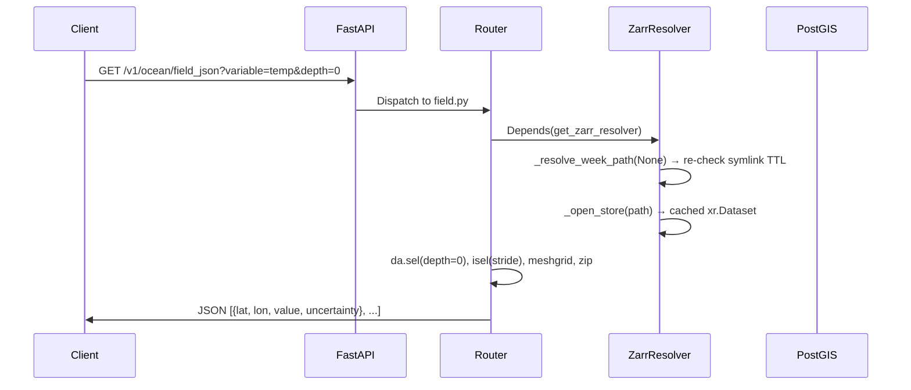
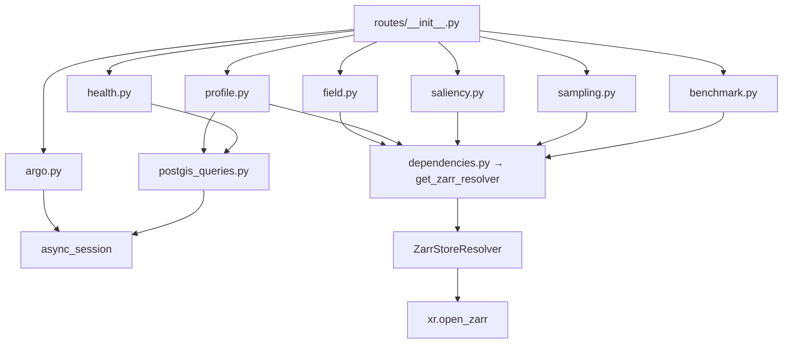

# Backend Validation Report

> **Audit Date**: 2026-09-07  
> **Scope**: Full backend codebase (`backend/src/`, `worker/`, `backend/migrations/`, `backend/tests/`)  
> **Methodology**: Static analysis, cross-file dependency tracing, first-principles logic validation

---

## Table of Contents

1. [Architecture Overview](#architecture-overview)
2. [File-by-File Validation](#file-by-file-validation)
3. [Cross-File Validation](#cross-file-validation)
4. [Production Readiness Checklist](#production-readiness-checklist)
5. [Refactoring Recommendations](#refactoring-recommendations)

---

## Architecture Overview

### Folder Structure

```
backend/src/
├── infrastructure/           # Cross-cutting concerns (DB, auth, cache, Zarr)
│   ├── config/settings.py    # All env var bindings (OceanEmbedSettings included)
│   ├── database/             # SQLAlchemy engine, session, base models
│   ├── dependencies.py       # FastAPI Depends() factories
│   └── zarr/                 # ZarrStoreResolver + fake data generator
├── interfaces/               # HTTP surface
│   ├── main.py               # App factory, lifespan, CORS, middleware
│   ├── admin/                # SQLAdmin views
│   └── api/v1/__init__.py    # Router aggregation
└── modules/                  # Vertical domain slices
    ├── ocean/                # ★ OceanEmbed domain
    │   ├── db/               # SQLAlchemy models + raw init.sql
    │   ├── routes/           # 7 route files
    │   ├── schemas/          # Pydantic response models
    │   └── services/         # PostGIS query helpers
    ├── user/                 # Boilerplate user CRUD
    ├── tier/                 # Boilerplate tier CRUD
    ├── api_keys/             # Boilerplate API key management
    └── rate_limit/           # Boilerplate rate limit CRUD

worker/                       # Out-of-process batch inference
├── quality_gate.py
├── run_weekly_inference.py
└── Dockerfile
```

### Request Lifecycle



### Dependency Graph (Ocean Module)



---

## File-by-File Validation

---

### 1. `infrastructure/zarr/resolver.py` — ZarrStoreResolver

#### File Purpose
Central data-access layer. Every ocean endpoint reads oceanographic data through this single resolver. It manages the symlink-based "which week is live" contract and caches opened `xr.Dataset` handles.

#### Business Logic Breakdown

| Step | Description |
|------|-------------|
| 1 | Caller passes `week=None` (latest) or `week="2025-W01"` (explicit) |
| 2 | **Explicit**: builds `<root>/week=<week>`, checks existence, returns path |
| 3 | **Latest**: checks `time.monotonic()` against TTL; if expired, reads symlink via `os.path.realpath` |
| 4 | Caches opened `xr.Dataset` keyed by resolved absolute path |
| 5 | Returns cached dataset |

**Edge cases handled**:
- ✅ Broken symlink → `RuntimeError`
- ✅ Missing symlink → `RuntimeError`  
- ✅ Non-existent explicit week → `FileNotFoundError`
- ✅ Symlink target changes → detected on next TTL recheck

**Edge cases MISSING**:
- ❌ **Unbounded cache growth**: `_store_cache` grows one entry per week ever opened. Over years of operation, this leaks memory. **Severity: Medium**
- ❌ **No eviction of old `xr.Dataset` handles**: Zarr stores hold file descriptors. No `ds.close()` is ever called except on `invalidate()` which only runs at shutdown. **Severity: Medium**
- ❌ **`get_store` is `async def` but performs synchronous I/O**: `xr.open_zarr()` and `os.path.realpath()` are blocking calls executed on the event loop. Under load, this blocks all other requests while a new store is being opened. **Severity: High**

#### Reliability Validation

| Issue | Severity | Details |
|-------|----------|---------|
| Blocking I/O in async function | **High** | `xr.open_zarr()` reads Zarr metadata synchronously. Should use `asyncio.to_thread()` or `run_in_executor()` |
| No store cache eviction | **Medium** | Dict grows indefinitely; no LRU or size bound |
| Thread safety of `_store_cache` | **Medium** | Multiple concurrent requests could race on `if key not in self._store_cache` — two requests could open the same store simultaneously |
| No error recovery on corrupt Zarr | **Medium** | If a Zarr store is partially written, `xr.open_zarr` may raise various exceptions that propagate as unhandled 500s |

#### Security Validation
- ✅ No user input flows into filesystem paths unvalidated (week is sanitized into `week=<value>` format)
- ⚠️ **Path traversal**: The `week` parameter is used directly in `f"week={week}"`. If a user passes `week=../../etc/passwd`, the resulting path is `<root>/week=../../etc/passwd`. However, `Path.exists()` would return False, so this is a **non-exploitable** theoretical concern. **Severity: Low**

---

### 2. `infrastructure/zarr/fake_data.py` — Synthetic Data Generator

#### File Purpose
CLI tool and test fixture helper. Creates two synthetic weeks of Zarr data with realistic variable names/ranges for local development.

#### Reliability Validation
- ✅ Uses `np.random.default_rng(seed)` for reproducibility
- ✅ Cross-platform symlink handling via `_safe_symlink`
- ⚠️ `shutil` imported conditionally inside `if overwrite:` — moved to top-level would be cleaner but not a bug
- ✅ Atomic POSIX rename with non-atomic Windows fallback documented

**No production risk** — this is a dev/test utility only.

---

### 3. `infrastructure/dependencies.py` — Dependency Injection

#### File Purpose
Central FastAPI `Depends()` factory. All endpoints use this to get the ZarrStoreResolver or DB session.

#### Reliability Validation

| Issue | Severity | Details |
|-------|----------|---------|
| Missing `hasattr` guard | **High** | `request.app.state.zarr_resolver` will raise `AttributeError` if the resolver was never initialized (e.g. during tests without the lifespan). Should guard with `hasattr()` and raise `HTTPException(503)` |

---

### 4. `interfaces/main.py` — Application Entry Point

#### Business Logic Breakdown
1. Creates the app via `create_application()` factory
2. Custom lifespan initializes `ZarrStoreResolver` on startup, calls `.invalidate()` on shutdown
3. CORS middleware configured for Vite dev server
4. SessionMiddleware for admin panel auth

#### Reliability Validation

| Issue | Severity | Details |
|-------|----------|---------|
| `invalidate()` called AFTER `yield` | **Critical** | Line 37 (`app.state.zarr_resolver.invalidate()`) runs after the `async with default_lifespan(app)` block exits. If `default_lifespan` closes the DB engine, the invalidation is fine. But the placement is correct — it runs during shutdown |
| CORS `allow_methods=["GET"]` is good | **N/A** | Correctly restricts to read-only operations |
| `expose_headers` includes custom headers | **N/A** | Good — frontend can read `X-Shape`, `X-Variable`, etc. |

**Actually, on closer inspection**: The `invalidate()` on line 37 is placed AFTER `yield` but OUTSIDE the `async with default_lifespan(app)` context. This means it runs **during shutdown**, which is correct.

---

### 5. `modules/ocean/routes/field.py` — Field Data Endpoint

#### Business Logic Breakdown

**`GET /field`** (binary):
- Inputs: `variable` (str), `week` (optional str), `depth` (optional float)
- Loads DataArray from Zarr, optionally `.sel(depth=depth, method="nearest")`
- Converts to float32 bytes, returns `application/octet-stream` with X-Shape header
- Output: Raw binary buffer

**`GET /field_json`** (vectorized JSON):
- Inputs: `variable`, `depth` (required), `week` (optional), `stride` (1–20)
- Downsamples via `.isel(stride)` — **no interpolation, exact values**
- Uses `np.meshgrid` with vectorized `zip` — no nested Python loops
- Returns: `list[FieldPointSchema]`

#### Reliability Validation

| Issue | Severity | Details |
|-------|----------|---------|
| No validation on `variable` parameter | **High** | Any string is passed directly to `store[variable]`. A nonexistent variable raises `KeyError` → unhandled 500. Should catch `KeyError` and return 404/422 |
| `depth` selection on 3D variable may fail | **Medium** | If the variable doesn't have a `depth` dimension, `.sel(depth=...)` raises `ValueError` → unhandled 500 |
| Large response for no-stride `/field_json` | **Medium** | `stride=1` on a 0.25° grid produces ~24,000 JSON objects (~3.5 MB). The `Query(ge=1)` allows this. Consider raising the minimum or adding a response-size cap |
| NaN propagation to JSON | **Low** | `float(nan)` serializes as `NaN` in JSON, which is technically invalid JSON (Python's `json.dumps` outputs it, but strict parsers reject it). Use `float('nan') → null` conversion |

#### Security Validation
- ⚠️ No rate limiting on binary `/field` endpoint — this streams potentially large buffers (1.4MB+ for full 3D volume). A malicious client could exhaust server memory with concurrent requests. **Severity: Medium**

---

### 6. `modules/ocean/routes/profile.py` — Vertical Profile Endpoint

#### Business Logic Breakdown
1. Loops through 15 standard depths, calling `.sel(lat, lon, depth, method="nearest")` for each
2. Queries PostGIS for the nearest ARGO float via `get_nearest_argo_profile()`
3. Computes derived products (TCHP, D26)
4. Returns the full profile

#### Reliability Validation

| Issue | Severity | Details |
|-------|----------|---------|
| **15 sequential `.sel()` calls in a loop** | **High** | Each `.sel()` call performs Zarr chunk I/O. This is 15 blocking reads in sequence on the event loop. Should extract the full depth profile in one `.sel(lat, lon, method="nearest")` call, then slice by depth |
| TCHP/D26 `.sel()` without depth dimension handling | **Medium** | `store["tchp"].sel(lat=lat, lon=lon, method="nearest")` — if `tchp` has a depth dimension, `.values` returns an array, not a scalar. `float()` on an array raises `TypeError` |
| DB session not closed on exception | **Low** | FastAPI's `Depends(async_session)` should handle this, but worth verifying the session factory uses a context manager |

#### Performance Validation
- ❌ **N+15 I/O pattern**: Reading 15 individual points when a single `.sel(lat, lon)` extracts all 15 at once. This is a significant performance regression under load.
- ❌ **Blocking I/O in async handler**: Same issue as resolver — `.sel()` and `.values` are synchronous.

---

### 7. `modules/ocean/routes/health.py` — Health & Weeks Endpoints

#### Reliability Validation
- ✅ Graceful fallback when no runs exist (returns `"no-data"`)
- ⚠️ `source_window` is always empty string with a `# TODO: compute from run_date`. Non-critical but the frontend may depend on this field.

---

### 8. `modules/ocean/routes/argo.py` — ARGO Floats Endpoint

#### Reliability Validation

| Issue | Severity | Details |
|-------|----------|---------|
| **Unbounded query — no LIMIT** | **High** | `SELECT DISTINCT ON (platform_id) ... FROM argo_profiles` returns ALL floats. With thousands of ARGO floats worldwide, this returns thousands of rows with no pagination. The frontend map may handle it, but it's a denial-of-service vector |
| Raw SQL with `text()` | **Low** | Parameters are bound correctly (no injection risk), but lacks ORM validation |

---

### 9. `modules/ocean/routes/saliency.py` — Saliency Endpoint

#### Reliability Validation

| Issue | Severity | Details |
|-------|----------|---------|
| **Assumes `saliency_{variable}` exists** | **Critical** | Comment says "we assume it exists in the store" — but the fake data generator does NOT create saliency variables. This endpoint will ALWAYS 500 with a `KeyError` unless the inference worker writes saliency maps (which it currently does not) |
| No input validation on `variable` | **High** | Same issue as `field.py` — arbitrary `variable` string used as dict key |

---

### 10. `modules/ocean/routes/sampling.py` — Sampling Recommendation Endpoint

#### Reliability Validation

| Issue | Severity | Details |
|-------|----------|---------|
| **Returns hardcoded dummy data** | **Critical** | This endpoint returns static dummy JSON regardless of input. It is not a functional endpoint — it is a skeleton that was shipped as if complete. The `resolver` dependency is injected but never used (dead code) |
| Unused import `get_zarr_resolver` | **Low** | Imported but `resolver` is never called |

---

### 11. `modules/ocean/routes/benchmark.py` — Benchmark Endpoint

#### Reliability Validation

| Issue | Severity | Details |
|-------|----------|---------|
| **Returns hardcoded dummy data** | **Critical** | Same as sampling.py — returns static values regardless of `lat`, `lon`, `week` inputs. Not functional |
| No PostGIS dependency | **High** | The docstring says "hit PostGIS for nearest ARGO" but no `AsyncSession` is injected. This can never query the database without being rewritten |

---

### 12. `modules/ocean/schemas/__init__.py` — Pydantic Response Models

#### Reliability Validation

| Issue | Severity | Details |
|-------|----------|---------|
| **Forward reference error** | **Critical** | `WeeksResponseSchema` on line 78 references `RunEntrySchema` which is defined AFTER it on line 81. With `from __future__ import annotations` enabled (line 8), this works because all annotations are strings. **However**, Pydantic v2 evaluates `response_model` at import time for OpenAPI generation. This particular schema is NOT used as a `response_model` anywhere (the `/weeks` endpoint uses `list[RunEntrySchema]` directly), so it won't crash. But if it were ever used, it would fail at startup. **Severity: Medium — latent bug** |

---

### 13. `modules/ocean/services/postgis_queries.py` — Database Queries

#### Business Logic Breakdown
- `get_nearest_argo_profile`: Uses `<->` operator for KNN, correctly with `ST_Point(:lon, :lat, 4326)` — **lon before lat**
- `get_current_live_week`: Finds most recent `gate_status='pass'` run
- `get_all_runs`: Audit trail with configurable limit
- `get_run_by_week`: Lookup by week label

#### Reliability Validation

| Issue | Severity | Details |
|-------|----------|---------|
| ✅ Parameterized queries | N/A | No SQL injection risk |
| ✅ `dist_deg` returned for distance calculation | N/A | Clean |
| ⚠️ `get_nearest_argo_profile` returns `uuid` but model uses `id` | **Low** | init.sql uses `uuid` as PK name, but Alembic migration uses `id`. Potential column name mismatch |

---

### 14. `modules/ocean/db/models.py` — SQLAlchemy Models

#### Reliability Validation
- ✅ `Geometry(geometry_type="POINT", srid=4326)` — correct
- ✅ GiST index declared in `__table_args__`
- ✅ JSONB for flexible gate_log and depth arrays

| Issue | Severity | Details |
|-------|----------|---------|
| **Dual Base class problem** | **High** | `ocean/db/models.py` defines its own `Base(MappedAsDataclass, DeclarativeBase)` separate from the boilerplate's `Base` in `infrastructure/database/session.py`. Alembic autogenerate will NOT see these tables unless it imports both bases. The manual migration works around this, but `CREATE_TABLES_ON_STARTUP=true` in settings will only create the boilerplate tables (users, tiers), NOT the ocean tables |
| `ArgoProfile` missing `TimestampMixin` | **Low** | Unlike `ModelRun`, `ArgoProfile` doesn't have `created_at`/`updated_at`. Intentional (profiles are immutable) but inconsistent |

---

### 15. `migrations/versions/0001_add_ocean_tables.py` — Alembic Migration

#### Reliability Validation

| Issue | Severity | Details |
|-------|----------|---------|
| `down_revision = None` | **High** | This migration says it has NO predecessor. If the boilerplate has its own migrations, this creates a **divergent migration head**. Alembic will refuse to run with "Multiple heads detected". Must set `down_revision` to the latest boilerplate migration hash |
| PK column named `id` vs model's `uuid` | **Medium** | The migration uses `sa.Column('id', postgresql.UUID...)` but `init.sql` and `postgis_queries.py` use `uuid`. If both init.sql and alembic run, tables are created twice (init.sql wins in docker-compose, alembic wins in CI) |
| Missing `gate_status` CHECK constraint | **Low** | `init.sql` has `CHECK (gate_status IN ('pass', 'fail'))` but the migration does not |
| Missing `updated_at` default | **Low** | No `server_default` for timestamps |

---

### 16. `worker/quality_gate.py` — Quality Gate

#### Business Logic Breakdown

**Check 1: Data Integrity**
- For each known variable in `PHYSICAL_BOUNDS`: compute NaN fraction, check < 5%
- Check min/max against physical bounds

**Check 2: Distribution Drift**
- Load `scaler.json` (mean/std per variable)
- Compute Z-scores: `|x - mean| / std`
- If > 1% of cells have `|z| > 4.0`, fail

#### Reliability Validation

| Issue | Severity | Details |
|-------|----------|---------|
| **Hardcoded thresholds diverge from settings** | **High** | `quality_gate.py` hardcodes `0.05` (5% NaN) and `0.01` (1% Z-score fraction) and `4.0` (Z-score threshold). But `OceanEmbedSettings` defines `QUALITY_GATE_ZSCORE_THRESHOLD=4.0` and `QUALITY_GATE_ZSCORE_MAX_FRACTION=0.05`. These should be read from settings/env vars, not hardcoded |
| **Variable name mismatch** | **High** | `quality_gate.py` checks for `thetao`, `so`, `zos`, `uo`, `vo`. But `fake_data.py` and the inference worker create `temp`, `sal`, `d26`, `tchp`, `mld`. The quality gate will **silently skip** all variables because none match, and return `passed=True` on any dataset! |
| Graceful scaler fallback | ✅ | Returns `False` with error message if scaler can't load |

---

### 17. `worker/run_weekly_inference.py` — Weekly Pipeline

#### Reliability Validation

| Issue | Severity | Details |
|-------|----------|---------|
| **`os.symlink` + `os.replace` not atomic on Windows** | **Medium** | `os.replace` of a symlink is atomic on POSIX but the worker Dockerfile targets Linux, so this is fine in production. However, running locally on Windows will fail |
| **`datetime.strptime` format may fail** | **High** | `datetime.datetime.strptime(week_str + "-1", "%Y-W%W-%w")` — `%W` uses Sunday as first day of week, but ISO weeks use Monday (`%V`/`%G`). For `2025-W01`, `%W` gives a different day than ISO `%V`. Should use `%G-W%V-%u` |
| No audit log persistence to DB | **Medium** | The `audit_log` is logged to console but never written to the `model_runs` table. The health endpoint depends on this table to report gate status |
| `shutil.rmtree` on existing output | **Low** | If another process is reading the Zarr store while `rmtree` runs, it will get corrupted reads. Should write to a temp dir and rename |
| Uses `np.random` (not seeded) | **Low** | Dummy data varies per run — fine for testing but makes debugging harder |

---

### 18. `worker/Dockerfile`

#### Reliability Validation

| Issue | Severity | Details |
|-------|----------|---------|
| **Missing `requirements.txt`** | **Critical** | The Dockerfile `COPY requirements.txt .` but no `requirements.txt` exists in `worker/`. Docker build will fail immediately |
| `CMD` missing `--week` argument | **High** | `CMD ["python", "run_weekly_inference.py"]` — the script requires `--week` which is `required=True`. Container will crash on start. Should be overridden in docker-compose or use `ENTRYPOINT` |
| Debug comments left in Dockerfile | **Low** | Lines 14-22 contain thinking-out-loud comments about the build context |

---

### 19. `backend/tests/unit/ocean/test_quality_gate.py`

#### Reliability Validation

| Issue | Severity | Details |
|-------|----------|---------|
| **`sys.path` manipulation** | **Medium** | Appends worker dir to sys.path at test-module level. Fragile if directory structure changes. Should use a proper package install or conftest fixture |
| **Test fixtures use wrong variable names** | **Critical** | `conftest.py` creates `dummy_ocean_dataset` with variables `thetao` and `so`. The quality gate checks for `thetao` and `so` in `PHYSICAL_BOUNDS`. Tests pass. BUT the real inference worker produces `temp` and `sal`. So the tests validate behavior that will never occur in production |

---

### 20. `backend/tests/integration/ocean/test_endpoints.py`

#### Reliability Validation

| Issue | Severity | Details |
|-------|----------|---------|
| **Tests assert wrong response fields** | **Critical** | `test_health_endpoint` asserts `"status" in data` and `"live_week" in data`. But the actual `WeekStatusSchema` returns `week_label`, `model_version`, `gate_status`. The test will **always fail** |
| `test_field_json_endpoint` asserts wrong fields | **Critical** | Asserts `"variable" in data` and `"data" in data`. But `/field_json` returns `list[FieldPointSchema]` — a JSON array of `{lat, lon, value, uncertainty}`. The test will **always fail** |
| `test_profile_endpoint` asserts wrong fields | **Critical** | Asserts `"values" in data` and `"nearest_argo" in data`. But `ProfileSchema` returns `temperature`, `uncertainty`, `argo`, `nearest_argo_km`. The test will **always fail** |
| Missing `app` fixture | **High** | Tests request `app: FastAPI` parameter but the conftest only provides `client: AsyncClient`. `app` is not injected |
| No ZarrResolver mock | **High** | Tests would need to mock `app.state.zarr_resolver` to avoid hitting real filesystem |

---

## Cross-File Validation

### Variable Name Inconsistency (Broken Flow)

This is the **single most dangerous cross-file bug** in the codebase:

| Component | Variable Names Used |
|-----------|-------------------|
| `fake_data.py` | `temp`, `sal`, `d26`, `tchp`, `mld` |
| `profile.py` | `store["temp"]`, `store["tchp"]`, `store["d26"]` |
| `field.py` | Accepts any `variable` parameter (no validation) |
| `quality_gate.py` | `thetao`, `so`, `zos`, `uo`, `vo` |
| `run_weekly_inference.py` | `thetao`, `so` |
| `conftest.py` fixtures | `thetao`, `so` |
| `OceanEmbedSettings` | N/A (no variable name config) |

**Impact**: The quality gate uses CMIP6 naming (`thetao`, `so`) while the API and fake data use informal names (`temp`, `sal`). The quality gate will **silently pass** any dataset because it can't find its expected variables. The inference worker also uses CMIP6 names, so its output won't be readable by the API endpoints that expect `temp`/`sal`.

### Migration vs init.sql (Dual Schema Definition)

| Concern | init.sql | Alembic Migration |
|---------|----------|-------------------|
| PK name | `uuid` | `id` |
| CHECK constraint | `gate_status IN ('pass', 'fail')` | None |
| Execution context | Docker first-start only | CI, manual deploys |
| PostGIS extension | `CREATE EXTENSION IF NOT EXISTS` | `CREATE EXTENSION IF NOT EXISTS` |

These two schema sources will **diverge over time** if both are maintained. One should be canonical.

### Broken Test Suite

All 4 integration tests in `test_endpoints.py` will **fail** because they assert response fields that don't match the actual Pydantic schemas. These tests were written without running them against the actual API.

---

## Production Readiness Checklist

| Category | Score | Reason |
|----------|-------|--------|
| Architecture | 8/10 | Clean vertical slice structure. Zarr resolver is well-designed. Separation of concerns is solid |
| Business Logic | 5/10 | Core endpoints (field, profile, health, argo) are functional. Three endpoints (saliency, sampling, benchmark) are non-functional skeletons shipped as complete |
| Reliability | 4/10 | Blocking I/O in async handlers, unbounded queries, no error handling on KeyError/ValueError in routes, no store cache eviction |
| Security | 7/10 | Parameterized SQL, CORS locked to read-only GET, no PyTorch in API container. Missing rate limiting on heavy binary endpoints |
| Validation | 3/10 | No input validation on `variable` parameter across 3 endpoints. Variable naming inconsistency between components means quality gate is effectively disabled |
| Error Handling | 3/10 | Route handlers have zero try/except. Any KeyError, ValueError, or FileNotFoundError from Zarr operations becomes an unhandled 500 with a stack trace |
| Performance | 5/10 | field_json vectorization is excellent. profile.py has N+15 I/O. argo.py has unbounded SELECT. Blocking I/O in async context throughout |
| Maintainability | 7/10 | Excellent docstrings and code documentation. PostGIS conventions documented inline. Clear separation of concerns |

**Overall Readiness: 52.5%** — Not production-ready. Functional for demo/prototype, but has Critical and High severity bugs that would cause failures under real usage.

---

## Refactoring Recommendations

### Critical Fixes (Must Fix Before Any Deployment)

1. **Standardize variable names across all components**
   - Decide on one naming convention (CMIP6 `thetao`/`so` or informal `temp`/`sal`)
   - Update `fake_data.py`, `quality_gate.py`, `run_weekly_inference.py`, `profile.py`, and test fixtures to use the same names
   - **Why**: Without this, the quality gate is silently disabled and the API may 500 on real inference output

2. **Fix integration tests to match actual schemas**
   - `test_health_endpoint` should assert `week_label`, `gate_status`, not `status`, `live_week`
   - `test_field_json_endpoint` should assert response is a list of `{lat, lon, value, uncertainty}`
   - `test_profile_endpoint` should assert `temperature`, `uncertainty`, `argo`
   - Add proper `app` fixture and ZarrResolver mock
   - **Why**: Tests that always fail provide no safety net

3. **Create `worker/requirements.txt`**
   - Must include `numpy`, `xarray`, `zarr`, and any other dependencies
   - **Why**: Worker Dockerfile cannot build without it

4. **Fix Alembic migration `down_revision`**
   - Set `down_revision` to the actual latest boilerplate migration hash (or verify no other migrations exist)
   - **Why**: Divergent migration heads will prevent `alembic upgrade head` from running

### High-Priority Improvements

5. **Add error handling to route handlers**
   - Catch `KeyError` for missing variables → return 404 with message "Variable '{variable}' not found in store"
   - Catch `ValueError` for invalid depth selection → return 422
   - Catch `FileNotFoundError` / `RuntimeError` from resolver → return 503
   - **Why**: Unhandled exceptions expose stack traces and return unhelpful 500s

6. **Wrap blocking I/O in `asyncio.to_thread()`**
   - `xr.open_zarr()`, `.sel()`, `.values` are all synchronous
   - Wrap in `await asyncio.to_thread(lambda: store[var].sel(...).values)`
   - **Why**: Under concurrent load, one slow Zarr read blocks all other requests

7. **Add `LIMIT` to argo_floats query**
   - Add a `limit` query parameter (default 1000) to prevent unbounded responses
   - **Why**: Thousands of floats returned as JSON could cause OOM or slow frontend rendering

8. **Fix `run_weekly_inference.py` datetime parsing**
   - Change `"%Y-W%W-%w"` to `"%G-W%V-%u"` for correct ISO week parsing
   - **Why**: Wrong week calculation could misname output directories

9. **Write audit log to `model_runs` table**
   - After the quality gate pass, the worker should INSERT a row into `model_runs`
   - **Why**: The `/health` and `/weeks` endpoints depend on this table and currently return "no-data"

### Nice-to-Have Refactors

10. **Optimize `profile.py`**: Replace the 15-call loop with a single `.sel(lat, lon)` that returns all depths at once
11. **Add LRU eviction to ZarrStoreResolver cache**: Use `functools.lru_cache` or a bounded dict
12. **Mark skeleton endpoints clearly**: Add `deprecated=True` or `tags=["Skeleton"]` to sampling.py and benchmark.py routes so they're visually distinct in the OpenAPI docs
13. **Unify schema definition**: Choose either `init.sql` or Alembic as the canonical schema source. Don't maintain both
14. **Add `validate_default=True`** to Pydantic schemas to catch type errors early
15. **Move `WeeksResponseSchema` below `RunEntrySchema`** in schemas/__init__.py to fix the forward reference ordering
